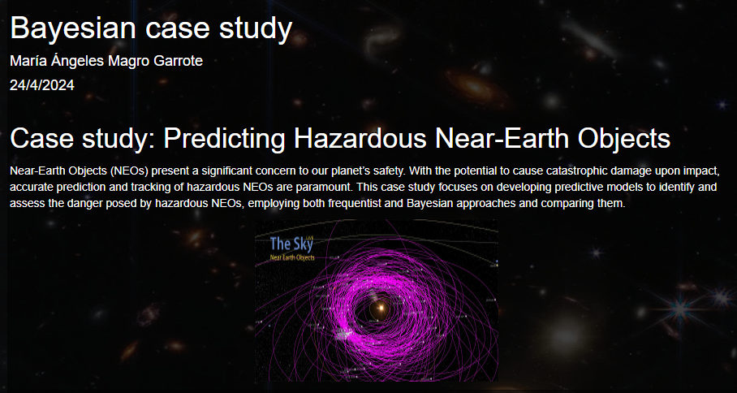

# Predicting Hazardous Near-Earth Objects Comparing Bayesian and Frequentist Approaches

## Overview
This project focuses on predicting hazardous Near-Earth Objects (NEOs) using both Bayesian and frequentist statistical methods. The objective is to develop predictive models that identify potentially dangerous NEOs based on various orbital and physical characteristics. The analysis employs a dataset provided by NASA and involves a comprehensive data preprocessing, feature selection, and model evaluation comparing both a frequentist and a bayesian approach.

## Project Structure

### 1. Dataset Preprocessing

1.1. Dataset Choice: NASA's dataset containing various NEO attributes (https://www.kaggle.com/datasets/shrutimehta/nasa-asteroids-classification).  
1.2. Feature Selection: Dimensionality reduction by selecting key variables influencing NEO hazard classification.  
1.3. Data Cleaning and Transformation: Addressing missing values and class imbalance using oversampling techniques.  
1.4. Variable Exploration & Visualization: Visualizing the distribution and relationship of variables.  
1.5. Training and Test Set Creation: Splitting the data into training and testing sets.  

### 2. Frequentist Model

2.1. Model Creation: Logistic regression model with regularization using the glmnet package.  
2.2. Model Output: Summary and interpretation of model coefficients.  
2.3. Prediction: Generating predictions on the test set and evaluating model accuracy.  

### 3. Bayesian Model (R2OpenBUGS)

3.1. Model Creation: Bayesian logistic regression using R2OpenBUGS.  
3.2. Model Convergence: Diagnostic plots for assessing convergence.  
3.3. Model Output: Posterior distribution analysis and interpretation.  

## How to Run

- **Install Required Packages**:
   - Ensure that R is installed along with the necessary packages: glmnet, R2OpenBUGS (you may need their software installed), corrplot, ggplot2, etc.
   - Use the command: `install.packages(c("glmnet", "R2OpenBUGS", "corrplot", "ggplot2"))`

## Results

The insights are avaiable at the end of the notebook uploaded.
